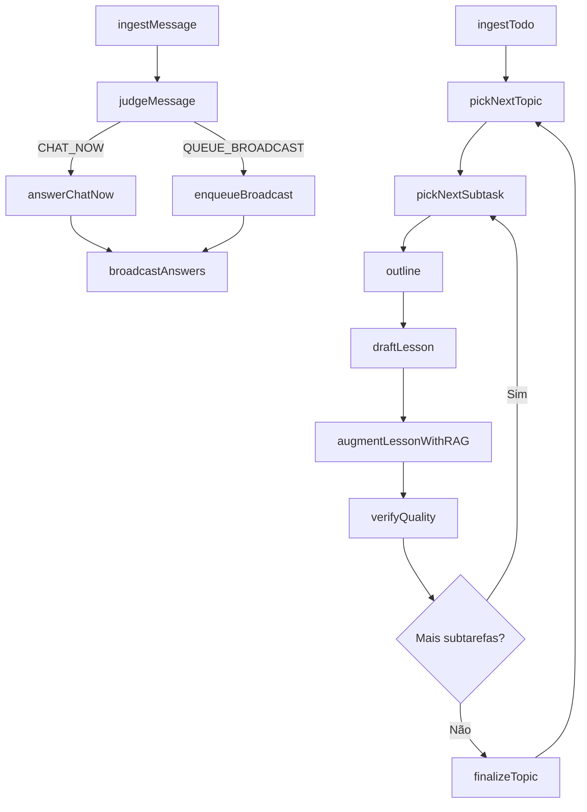

# Agentic Training System

Sistema agentic para geração de aulas sequenciais a partir de um TODO externo, com chat paralelo moderado por um julgador e suporte a RAG para grounding e respostas com citações.

## Sumário
1. Problema & Visão
2. Arquitetura
3. Fluxo Alto Nível (Mermaid)
4. Nós do Grafo
5. RAG Policy
6. Como Rodar
7. Testes
8. Variáveis de Ambiente
9. Observabilidade

## 1. Problema & Visão
Equipes possuem planos (TODO hierárquico) e precisam transformá-los em aulas interativas. O sistema ingere o plano e gera aulas incrementalmente enquanto gerencia perguntas em paralelo sem interromper o fluxo principal.

## 2. Arquitetura
- Orquestração: LangGraph (StateGraph)
- Server: Fastify
- RAG: Agente com retrieve/ground/answerWithCitations
- Chat paralelo: Julgador decide rota (CHAT_NOW, QUEUE_BROADCAST, IGNORE)
- Broadcast: execução em pausas temporizadas ou fim de seção
- Observabilidade: eventos estruturados + métricas stub

## 3. Fluxo Alto Nível


## 4. Nós do Grafo (Resumo)
| Nó | Responsabilidade |
|----|------------------|
| ingestTodo | Normalizar payload em estado inicial |
| pickNextTopic | Selecionar próximo tópico não finalizado |
| pickNextSubtask | Selecionar próxima subtask |
| outline | Criar esqueleto de lição |
| draftLesson | Redigir texto preliminar |
| augmentLessonWithRAG | Grounding e citações |
| verifyQuality | Heurísticas de revisão |
| finalizeTopic | Marcar tópico concluído |
| ingestMessage | Ingerir mensagem de participante |
| judgeMessage | Classificar rota e necessidade RAG |
| answerChatNow | Resposta curta imediata |
| enqueueBroadcast | Enfileirar pergunta priorizada |
| broadcastAnswers | Responder conjunto em bloco |
| checkQuestions | Decisão de pausa para broadcast |

## 5. RAG Policy
| Caso | Uso RAG |
|------|---------|
| Fato factual ou citação exigida | Obrigatório |
| Conceito comum amplamente conhecido | Opcional (heurística) |
| Pergunta de facilitação/processo | Não usar |

Formato de citação: [[ref:N]] descrito em `docs/RAG_AGENT.md`.

## 6. Como Rodar
Instale dependências e rode em modo dev.

```bash
npm ci
cp .env.example .env
npm run dev
```

Build & start:
```bash
npm run build
npm start
```

## 7. Testes
```bash
npm test
```
Coverage alvo: 70%.

## 8. Variáveis de Ambiente
| Nome | Descrição | Obrigatório |
|------|-----------|-------------|
| OPENAI_API_KEY | Chave LLM | Sim |
| RAG_ENABLED | Ativa RAG | Não (default true) |
| NODE_ENV | Ambiente | Não |

## 9. Observabilidade
Eventos principais: `message_ingested`, `judge_decision`, `chat_now_answered`, `enqueued_broadcast`, `broadcast_done`, `rag.retrieve`, `rag.ground` com latência e contadores.

## Diagrama Sequence Exemplos
Ver `docs/SEQUENCE.md`.

---
MIT License.
