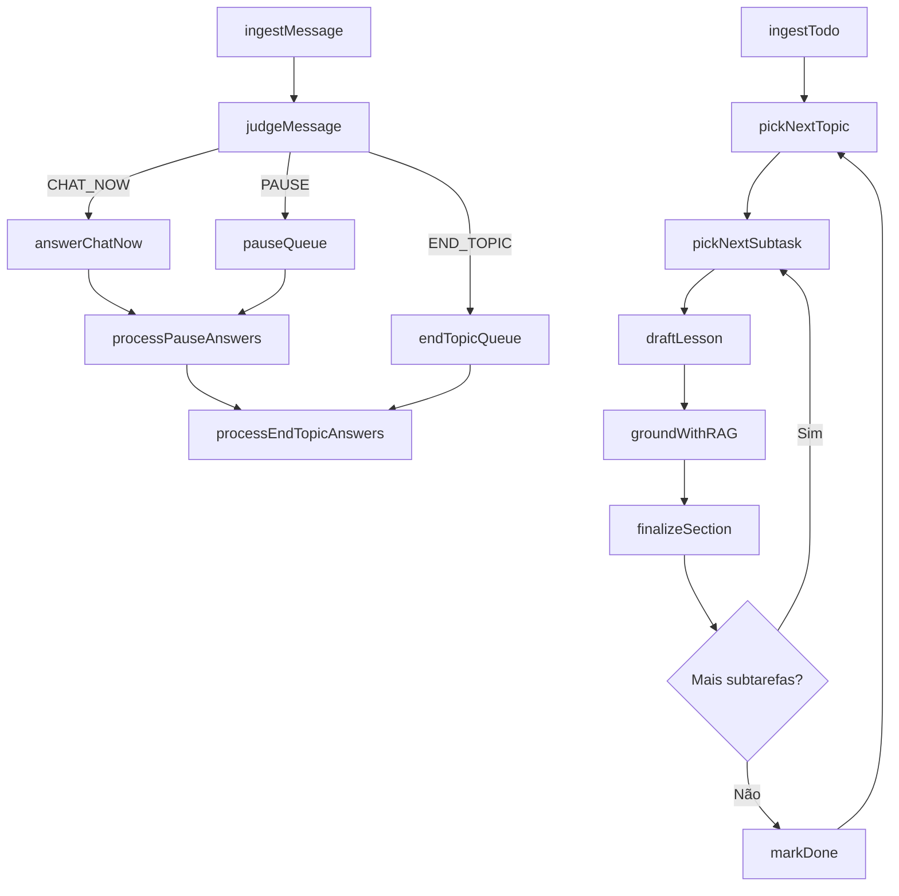

# 🤖 Sistema Agentic de Treinamento IA

Sistema completo de ensino interativo usando LangGraph, LangChain, Fastify e RAG para geração de conteúdo adaptativo e chat em tempo real.

## ✨ Funcionalidades Principais

- **Geração Automática de Lições**: Pipeline completo com RAG e LLM
- **Chat Inteligente em Tempo Real**: Ações implementadas (CHAT_NOW, PAUSE, END_TOPIC) + rotas planejadas (NOTE, IGNORE)
- **Streaming Server-Sent Events**: Interface responsiva com eventos em tempo real
- **Sistema Multi-Agente**: LangGraph com nós especializados para diferentes tarefas
- **RAG Integrado**: Base de conhecimento com busca semântica
- **Interface Web Progressiva**: Progressive enhancement com fallbacks

## 🚀 Quick Start

### Pré-requisitos

```bash
node >= 20.0.0
npm >= 9.0.0
```

### Instalação

```bash
# Clone o repositório
git clone <repo-url>
cd ai-tutor-avatar

# Instale dependências
npm install

# Configure variáveis de ambiente
cp .env.example .env
# Edite .env com suas chaves API
```

### Execução

```bash
# Desenvolvimento (com hot reload)
npm run dev

# Produção
npm run build
npm start

# Testes
npm test
```

### Variáveis de Ambiente Obrigatórias

```env
OPENAI_API_KEY=sk-...          # Chave OpenAI para LLM
PORT=3000                      # Porta do servidor (opcional)
NODE_ENV=development           # Ambiente de execução
```

## 2. Arquitetura

- Orquestração: LangGraph (StateGraph)
- Server: Fastify
- RAG: Agente com retrieve/ground/answerWithCitations
- Chat paralelo: Julgador decide rota (CHAT_NOW, PAUSE, END_TOPIC) – futuras (NOTE, IGNORE)
- Broadcast: execução em pausas temporizadas ou fim de seção
- Observabilidade: eventos estruturados + métricas stub

## 3. Fluxo Alto Nível



## 4. Nós do Grafo (Resumo)

| Nó | Responsabilidade |
|----|------------------|
| ingestTodo | Normalizar payload em estado inicial |
| pickNextTopic | Selecionar próximo tópico não finalizado |
| pickNextSubtask | Selecionar próxima subtask |
| draftLesson | Redigir texto base inicial |
| groundWithRag | Geração LLM com citações |
| finalizeSection | Persistir seção concluída |
| markDone | Marcar fim total curso |
| ingestMessage | Ingerir mensagem de participante |
| judgeMessage | Classificar rota e necessidade RAG |
| answerChatNow | Resposta curta imediata |
| processPauseAnswers | Gera inserts de perguntas PAUSE |
| processEndTopicAnswers | Gera insert de consolidação END_TOPIC |
| checkQuestions | Responder CHAT_NOW prioritário |

## 5. RAG Policy

| Caso | Uso RAG |
|------|---------|
| Fato factual ou citação exigida | Obrigatório |
| Conceito comum amplamente conhecido | Opcional (heurística) |
| Pergunta de facilitação/processo | Não usar |

Formato de citação: [[ref:N]] descrito em `docs/RAG_AGENT.md`.

## 6. Como Rodar

Instale dependências e rode em modo dev.

```bash
npm ci
cp .env.example .env
npm run dev
```

Build & start:
```bash
npm run build
npm start
```

## 7. Testes


```bash
npm test
```

Coverage alvo: 70%.

## 8. Variáveis de Ambiente

| Nome | Descrição | Obrigatório |
|------|-----------|-------------|
| OPENAI_API_KEY | Chave LLM | Sim |
| RAG_ENABLED | Ativa RAG | Não (default true) |
| NODE_ENV | Ambiente | Não |

## 9. Observabilidade

Eventos principais (logs applicativos + SSE):

- Logs internos: `rag.llm_initialized`, `graph_invoke_success`, `chat.classify_start`, `chat.classify_result`, `lesson_manager_init`.
- SSE (`/course/stream`): `log`, `heartbeat`, `lesson`, `insert`, `done`, `error` (payload sempre inclui campo `type`).

Observabilidade detalhada em `docs/ARCHITECTURE.md` e `docs/OBSERVABILITY.md`.

## 10. Teste Manual Rápido

Passos numerados:

1. Inicie servidor:

  ```bash
  npm run dev
  ```

1. Abra UI: <http://localhost:3000/ui> (ou porta configurada)

1. Abra console dev para ver heartbeats (SSE) e inserts.

1. Envie pergunta via fetch:

  ```bash
  curl -X POST http://localhost:3000/chat/send -H "Content-Type: application/json" -d '{"message":"Explique overfitting?","sessionId":"manual"}'
  ```

1. Forçar rota para teste determinístico:

  ```bash
  curl -X POST http://localhost:3000/chat/send -H "Content-Type: application/json" -d '{"message":"forçar pausa","sessionId":"manual","forceRoute":"PAUSE"}'
  ```

1. Abrir stream direto:

  ```bash
  curl http://localhost:3000/course/stream
  ```

Você deve ver `heartbeat` inicial (<1s) seguido de eventos `lesson` e eventualmente `insert`.

## 11. Diferenças Planejadas vs Implementado

- NOTE / IGNORE ainda não implementados.
- Curador e Verificador ainda não ativos.
- RAG é stub; índice vetorial real pendente.
- Checkpointing persistente (disk/redis) ainda não presente.

## Diagrama Sequence Exemplos

Ver `docs/SEQUENCE.md`.

---
MIT License.
