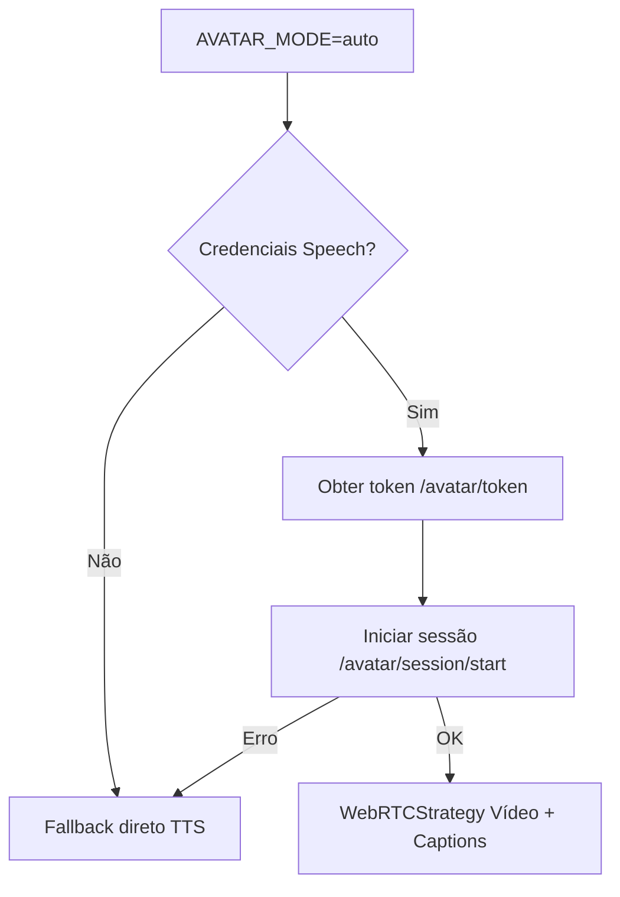

# Configuração do Avatar (WebRTC / TTS Fallback)

Guia prático para habilitar e depurar o Avatar (Azure AI) no projeto.

## 🔍 Visão Geral

O front inicializa um `AvatarController` que tenta (modo `auto`) iniciar WebRTC com renderização em vídeo. Se falhar em tempo hábil (ou modo forçado `tts`), usa síntese de voz sequencial (fila de chunks). As configurações vêm de variáveis de ambiente e do endpoint `/avatar/config`.

Fluxo simplificado:



## 🧪 Modos Suportados

| Valor | Comportamento |
|-------|---------------|
| `auto` (default) | Tenta WebRTC → fallback TTS se falha/sem credenciais |
| `webrtc` | Exige credenciais válidas; se indisponível resulta em erro (futuro: timeout controlará fallback) |
| `tts` | Força somente TTS (não chama endpoints de sessão) |

## 🌐 Endpoint Público `/avatar/config`

Resposta típica:

```json
{
  "mode": "auto",
  "useTcp": true,
  "useTcpForWebRtc": true,
  "privateEndpoint": null,
  "character": "lisa",
  "style": "casual-sitting",
  "bgColor": null
}
```

Uso no front (já implementado):

```js
const cfg = await (await fetch('/avatar/config')).json();
window.AVATAR_CONFIG = cfg; // debug
```

## 🔑 Variáveis de Ambiente

| Variável | Default | Obrigatória? | Efeito |
|----------|---------|--------------|--------|
| `SPEECH_KEY` | — | Para WebRTC/TTS Azure | Chave de subscrição Speech (nunca vai ao front) |
| `SPEECH_REGION` | — | Para WebRTC/TTS Azure | Região ex: `eastus` |
| `SPEECH_PRIVATE_ENDPOINT` | `null` | Não | Endpoint privado completo (precede region) |
| `AVATAR_MODE` | `auto` | Não | Seleciona fluxo (`auto`, `webrtc`, `tts`) |
| `AVATAR_USE_TCP` | `true` | Não | Força transporte TCP para ICE (firewalls corporativos) |
| `AVATAR_CHARACTER` | `lisa` | Não | Personagem do stream WebRTC |
| `AVATAR_STYLE` | `casual-sitting` | Não | Estilo/pose inicial avatar |
| `AVATAR_BG_COLOR` | `null` | Não | Cor de fundo (se suportado) |

Notas:

- `AVATAR_USE_TCP=false` desabilita adição de `transport=tcp` na URL ICE.
- `SPEECH_PRIVATE_ENDPOINT` tem precedência sobre (`SPEECH_REGION`,`SPEECH_KEY`) ao construir `SpeechConfig.fromEndpoint`.

## 🔁 Fallback & Conectividade

| Etapa | Sucesso | Falha |
|-------|---------|-------|
| Obter token (`/avatar/token`) | Prossegue para sessão | Log `avatar.token_error` → fallback TTS |
| Iniciar sessão (`/avatar/session/start`) | Cria PC e ICE servers | Log `avatar.session_start_error` → fallback TTS |
| ICE / WebRTC init (futuro timeout) | Vídeo + captions | Timeout planejado (<3s) → fallback TTS |

## 📦 Estruturas Principais (Front)

| Arquivo | Responsabilidade |
|---------|------------------|
| `public/ui/avatarWebRTC.js` | Estratégia WebRTC (peer connection, captions, vídeo) |
| `public/ui/avatarPlayer.js` | Player TTS (fila de chunks, síntese sequencial) |
| `public/ui/avatarShared.js` | Utilitários: segmentação, montagem SSML |
| `public/ui/ui.js` | Orquestração: fetch config, cria controller, expõe `window.avatarSpeak` |

## 🗣️ Exemplo Mínimo de Envio de Texto

Após a UI carregar (e `avatarController` escolher a estratégia):

```js
// Envia uma frase (fila TTS ou WebRTC data-channel interna)
window.avatarSpeak('Olá, este é um teste rápido do avatar.');

// Várias frases sequenciais
['Primeira parte.', 'Agora a segunda.', 'Encerrando.'].forEach(t => window.avatarSpeak(t));
```

A função já cuida de segmentar textos longos (> ~400 chars) antes de enfileirar.

## 🧵 TCP vs UDP (ICE)

- `AVATAR_USE_TCP=true` adiciona `transport=tcp` à URL do STUN/TURN fornecida pelo relay (ou stub).
- Útil atrás de firewalls corporativos que bloqueiam UDP. Pode aumentar latência inicial.

## 🔐 Segurança

- Chave nunca exposta: somente token efêmero entregue ao front.
- Tokens armazenados em cache in-memory por até ~9 minutos (`/avatar/token`).

## 🛠️ Troubleshooting Rápido

| Sintoma | Indício | Ação |
|---------|--------|------|
| Silêncio total | Falhou token/sessão e fallback não disparou | Ver logs `avatar.session_start_error` no backend |
| Voz funciona mas sem vídeo | Falha WebRTC → fallback TTS | Confirmar se credenciais/região corretas / firewall |
| Conexão demora muito | ICE bloqueado UDP | Ativar/confirmar `AVATAR_USE_TCP=true` |
| Voz incorreta/estilo não muda | Personagem fixo POC | Ajustar futuro suporte SSML avançado |

## 📊 Próximas Melhorias (Roadmap Avatar)

1. Timeout explícito <3s para init WebRTC com métrica `avatar.webrtc_start_ms`.
2. Limite de fila (`MAX_QUEUE_SIZE`) com trimming e métrica de pico.
3. Métricas unificadas `avatar.*` (start, fallback_reason, queue_max, reconnect_count).
4. Dual queue (prioridade alta vs normal) para respostas imediatas de chat.

## ✅ Checklist de Validação (Manual Rápido)

- [ ] `AVATAR_MODE=tts` não faz chamadas `/avatar/session/start`.
- [ ] `AVATAR_MODE=auto` sem credenciais → TTS operacional.
- [ ] `AVATAR_MODE=auto` com credenciais → tenta WebRTC (logs); fallback se falha.
- [ ] `AVATAR_USE_TCP=false` remove parâmetro `transport=tcp` dos ICE servers.

## 📚 Referências

- Azure Speech / Avatar Samples (paridade campo `useTcpForWebRtc`).
- Arquivos locais citados nesta doc.

---
*Documento gerado automaticamente em 2025-08-18.*
