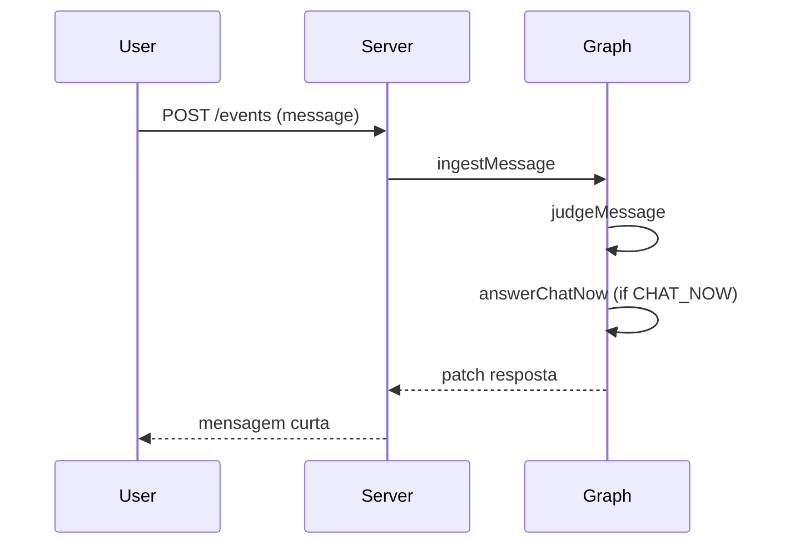
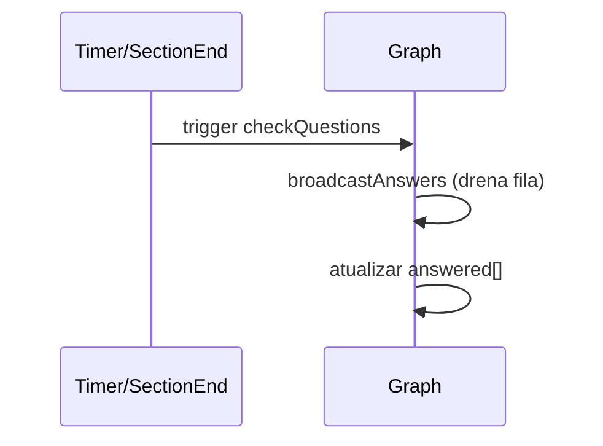
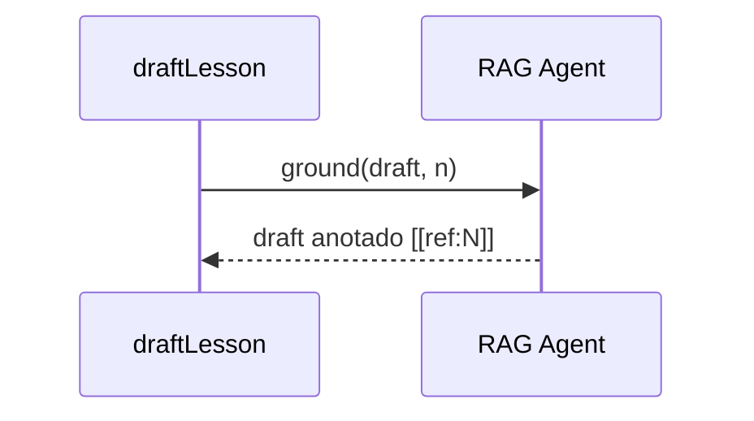

# Sequências

## Chat Now

```mermaid
sequenceDiagram
participant U as User
participant S as Server
participant G as Graph
U->>S: POST /events (message)
S->>G: ingestMessage
G->>G: judgeMessage
G->>G: answerChatNow (if CHAT_NOW)
G-->>S: patch resposta
S-->>U: mensagem curta
```

## Broadcast

```mermaid
sequenceDiagram
participant T as Timer/SectionEnd
participant G as Graph
T->>G: trigger checkQuestions
G->>G: broadcastAnswers (drena fila)
G->>G: atualizar answered[]
```

## augmentLessonWithRAG

```mermaid
sequenceDiagram
participant L as draftLesson
participant R as RAG Agent
L->>R: ground(draft, n)
R-->>L: draft anotado [[ref:N]]
```
