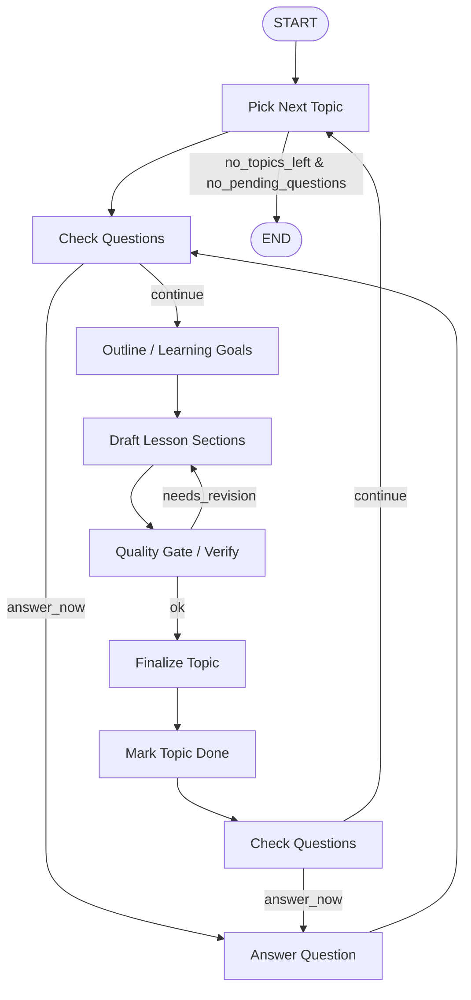
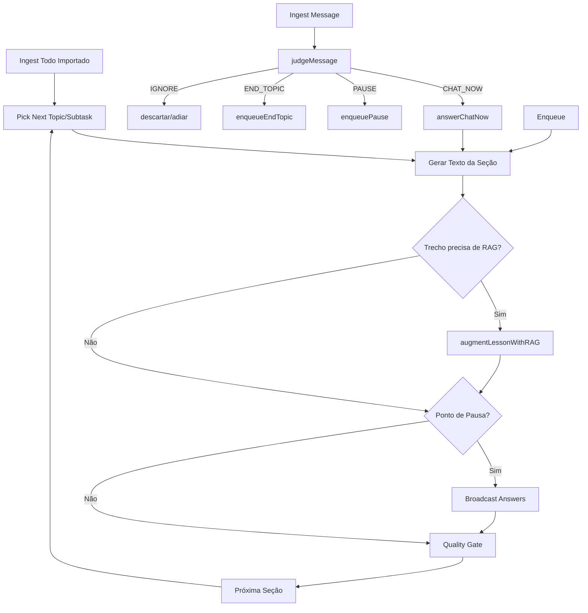

# Sistema Agentic de Treinamento com LangChain + LangGraph (JS)

> **Fonte de Verdade** - Especificação técnica completa do sistema de treinamento baseado em agentes inteligentes  
> **Versão:** 1.0  
> **Data:** Agosto 2025  
> **Status:** Design/Conceitual

---

## 📑 Índice

1. [Visão Geral](#1-visão-geral)
2. [Arquitetura de Agentes](#2-arquitetura-de-agentes)
3. [Fluxo Principal](#3-fluxo-principal)
4. [Modelos de Dados](#4-modelos-de-dados)
5. [Implementação LangGraph](#5-implementação-langgraph)
6. [Sistema de Julgamento](#6-sistema-de-julgamento)
7. [Gestão de Interrupções](#7-gestão-de-interrupções)
8. [TodoList e Curadoria](#8-todolist-e-curadoria)
9. [Integração Chat](#9-integração-chat)
10. [Pipeline Pedagógico](#10-pipeline-pedagógico)
11. [Sistema RAG](#11-sistema-rag)
12. [Prompts e Templates](#12-prompts-e-templates)
13. [Observabilidade](#13-observabilidade)
14. [Otimização](#14-otimização)
15. [Roadmap](#15-roadmap)
16. [Cenários de Uso](#16-cenários-de-uso)
17. [Considerações Técnicas](#17-considerações-técnicas)

---

## 1. Visão Geral

### 🎯 Conceito Central

Um **"professor-agente"** que percorre um **TodoList de tópicos importado** para gerar cursos de forma **sequencial e lógica**, mas que também **interrompe** o fluxo para responder dúvidas do chat **quando fizer sentido**, usando um **Julgador** que decide **se deve responder agora** (alta urgência/relevância) **ou depois** (fila/adiamento), com **retomada exata de contexto** graças ao **checkpointing** do LangGraph.

### 🎭 Metáfora do Maestro

Pense em um **maestro** (Agente Treinador) conduzindo a **partitura** já escrita (Todo importado). A plateia (alunos) levanta a mão: o **jurado** (Julgador) decide se a dúvida é um **sussurro ao lado** (chat agora), um **anúncio ao auditório** (broadcast na pausa), ou algo que **não pertence ao concerto** (adiar/descartar).

### 🏆 Objetivos

- **Funcional**: Produzir materiais de treinamento (aulas, resumos, exemplos, exercícios, quizzes) de ponta a ponta a partir de um **TodoList importado**
- **Interativo**: Gerenciar mensagens de chat com roteamento inteligente (agora vs depois vs ignorar)
- **Robusto**: Usar **LangGraph** para orquestração com **checkpointing** para pausar/retomar e auditar decisões

### ✅ Resultado Esperado

Um pipeline agentic que combina:
- **Ingestão de Todo importado**
- **Geração dinâmica de conteúdo**  
- **Triagem/roteamento de perguntas** (chat agora vs broadcast depois)
- **Progresso controlado com auditoria completa**

---

## 2. Arquitetura de Agentes

### 🤖 Agentes e Responsabilidades

#### 2.1 Agente Treinador (Principal)
- **Função**: Consumir TodoList importado e gerar aulas sequenciais
- **RAG-Enrichment**: Consulta Agente de RAG quando precisa de fatos, números, citações
- **Controle**: Mantém fio lógico do curso e decide onde inserir conteúdo ancorado

#### 2.2 Agente Curador/Editor de Todo
- **Função**: Editar TodoList importado (repriorizar, promover/demover subtarefas)
- **Restrição**: Não inventa conteúdo novo, apenas organiza a trilha
- **Trigger**: Disparado via chat conforme sinais da turma

#### 2.3 Agente Julgador (Prioritizer)
- **Função**: Classificar mensagens em `CHAT_NOW`, `PAUSE`, `END_TOPIC` ou `IGNORE`
- **Inteligência**: Sinaliza necessidade de grounding RAG (`needsRAG=true`)
- **Critérios**: Bloqueio, alinhamento, tempo, recorrência, segurança

#### 2.4 Agente Respondedor
- **CHAT_NOW**: Respostas curtas e diretas
- **BROADCAST**: Respostas estruturadas com RAG sempre que possível
- **Output**: Gera resumos anexados às notas da seção

#### 2.5 Agente de RAG (Bibliotecário)
- **APIs**: `retrieve(query, topicId?)`, `ground(draft, n=K)`, `cite(snippets)`
- **Gestão**: Conectores, ingestão, indexação, políticas de citação
- **Qualidade**: Métricas (precision@K, groundedness), fallbacks

#### 2.6 Agente Verificador (Opcional)
- **Função**: Verificar clareza pedagógica, correção técnica, aderência às fontes
- **Ação**: Pode pedir revisão ao Treinador se qualidade < threshold

---

## 3. Fluxo Principal

### 📊 Diagrama de Alto Nível



### 🔄 Fluxo Detalhado com RAG



### 🎯 Pontos-chave do Fluxo

- **Check Questions** aparece várias vezes para permitir **interrupções naturais**
- **Answer Question** retorna para **Check Questions** (podem existir múltiplas dúvidas urgentes)
- **Verify** cria **ciclo de revisão** até atingir qualidade desejada
- **Checkpointing** permite retomada exata após interrupções

---

## 4. Modelos de Dados

### 📝 Schemas TypeScript + Zod

```typescript
import { z } from "zod";

// TodoList Item
export const TodoItem = z.object({
  id: z.string(),
  title: z.string(),
  status: z.enum(["pending", "in_progress", "done"]).default("pending"),
  priority: z.number().default(0),
  dependsOn: z.array(z.string()).default([]),
  notes: z.string().optional(),
});

// Pergunta/Mensagem
export const Question = z.object({
  id: z.string(),
  text: z.string(),
  source: z.enum(["chat", "agent"]).default("chat"),
  topicId: z.string().optional(),
  timestamp: z.number(),
});

// Seção da Aula
export const LessonSection = z.object({
  kind: z.enum(["overview","theory","examples","exercises","quiz"]),
  content: z.string(),
});

// Aula Completa
export const Lesson = z.object({
  topicId: z.string(),
  learningGoals: z.array(z.string()),
  sections: z.array(LessonSection),
  qualityScore: z.number().optional(),
});

// Mensagem de Chat
export const Message = z.object({
  id: z.string(),
  from: z.string(),
  text: z.string(),
  ts: z.number(),
});

// Item da Fila de Broadcast
export const BroadcastItem = z.object({
  id: z.string(),
  questionId: z.string(),
  score: z.number(), // prioridade calculada
  reason: z.string(),
});

// Estado Principal do Sistema
export const TrainingState = z.object({
  // TodoList e Progresso
  todo: z.array(TodoItem),
  currentTopicId: z.string().optional(),
  lessons: z.record(z.string(), Lesson).default({}),
  
  // Sistema de Mensagens
  participants: z.array(z.object({ id: z.string(), name: z.string() })).default([]),
  messages: z.array(Message).default([]),
  questionsQueue: z.array(Question).default([]),
  pendingQuestions: z.array(Question).default([]),
  broadcastQueue: z.array(BroadcastItem).default([]),
  answered: z.array(z.object({ 
    id: z.string(), 
    answer: z.string(), 
    questionId: z.string() 
  })).default([]),
  
  // Controle de Fluxo
  route: z.enum(["ANSWER_NOW","CONTINUE","FINISH"]).optional(),
  logs: z.array(z.string()).default([]),
});

export type TrainingStateT = z.infer<typeof TrainingState>;
```

### 🔄 Fórmula de Prioridade

```
score = w1*generalidade + w2*novidade + w3*impacto_no_objetivo - w4*custo_tempo
```

Onde:
- **generalidade**: probabilidade de ser útil para muitos
- **novidade**: distância semântica de perguntas já respondidas  
- **impacto_no_objetivo**: relação com learning goals atuais
- **custo_tempo**: tamanho/complexidade estimada da resposta

---

## 5. Implementação LangGraph

### 🏗️ Estrutura do Grafo

```typescript
import { StateGraph, END } from "@langchain/langgraph";
import { TrainingState } from "./state";

// Nós principais
async function pickNextTopic(state: TrainingStateT) {
  const next = state.todo
    .filter(t => t.status === "pending" && 
      t.dependsOn.every(id => 
        state.todo.find(x => x.id === id)?.status === "done"))
    .sort((a,b) => b.priority - a.priority)[0];

  if (!next) {
    const hasQuestions = state.questionsQueue.length > 0 || 
                        state.pendingQuestions.length > 0;
    return { route: hasQuestions ? "ANSWER_NOW" : "FINISH" };
  }

  return {
    currentTopicId: next.id,
    todo: state.todo.map(t => 
      t.id === next.id ? { ...t, status: "in_progress" } : t),
    route: "CONTINUE",
  };
}

async function checkQuestions(state: TrainingStateT) {
  const q = state.questionsQueue[0];
  if (!q) return { route: "CONTINUE" };

  const shouldAnswerNow = await judge(q, state);
  if (shouldAnswerNow) return { route: "ANSWER_NOW" };

  const [first, ...rest] = state.questionsQueue;
  return { 
    pendingQuestions: [...state.pendingQuestions, first], 
    questionsQueue: rest, 
    route: "CONTINUE" 
  };
}

async function outline(state: TrainingStateT) {
  const topic = state.todo.find(t => t.id === state.currentTopicId);
  const { learningGoals, sectionsDraft } = await llmOutline(topic);
  
  return {
    lessons: {
      ...state.lessons,
      [topic.id]: { 
        topicId: topic.id, 
        learningGoals, 
        sections: sectionsDraft 
      }
    },
    route: "CONTINUE",
  };
}

async function draftLesson(state: TrainingStateT) {
  const topic = state.currentTopicId!;
  const lesson = state.lessons[topic];
  const sections = await llmDraftSections(lesson);
  
  return {
    lessons: { 
      ...state.lessons, 
      [topic]: { ...lesson, sections } 
    },
    route: "CONTINUE",
  };
}

async function verifyQuality(state: TrainingStateT) {
  const topic = state.currentTopicId!;
  const lesson = state.lessons[topic];
  const score = await llmVerify(lesson);
  
  if (score < 0.8) {
    const improved = await llmRevise(lesson);
    return { 
      lessons: { ...state.lessons, [topic]: improved }, 
      route: "CONTINUE" 
    };
  }
  
  return { 
    lessons: { 
      ...state.lessons, 
      [topic]: { ...lesson, qualityScore: score } 
    }, 
    route: "CONTINUE" 
  };
}

async function finalizeTopic(state: TrainingStateT) {
  const topic = state.currentTopicId!;
  return {
    todo: state.todo.map(t => 
      t.id === topic ? { ...t, status: "done" } : t),
    currentTopicId: undefined,
    route: "CONTINUE",
  };
}

async function answerQuestion(state: TrainingStateT) {
  const q = state.questionsQueue[0] ?? state.pendingQuestions[0];
  if (!q) return { route: "CONTINUE" };

  const { answer, references } = await llmAnswer(q, state);

  const removeFrom = state.questionsQueue[0] ? "queue" : "pending";
  const newQueue = removeFrom === "queue" ? 
    state.questionsQueue.slice(1) : state.questionsQueue;
  const newPending = removeFrom === "pending" ? 
    state.pendingQuestions.slice(1) : state.pendingQuestions;

  return {
    answered: [...state.answered, { 
      id: crypto.randomUUID(), 
      answer, 
      questionId: q.id 
    }],
    questionsQueue: newQueue,
    pendingQuestions: newPending,
    route: "CONTINUE",
  };
}

// Construção do Grafo
const graph = new StateGraph(TrainingState)
  .addNode("pickNextTopic", pickNextTopic)
  .addNode("checkQuestions", checkQuestions)
  .addNode("outline", outline)
  .addNode("draftLesson", draftLesson)
  .addNode("verifyQuality", verifyQuality)
  .addNode("finalizeTopic", finalizeTopic)
  .addNode("answerQuestion", answerQuestion)
  .addEdge("pickNextTopic", "checkQuestions")
  .addConditionalEdges("checkQuestions", (s) => 
    s.route === "ANSWER_NOW" ? "answerQuestion" : 
    s.route === "FINISH" ? END : "outline")
  .addEdge("outline", "draftLesson")
  .addEdge("draftLesson", "verifyQuality")
  .addEdge("verifyQuality", "finalizeTopic")
  .addEdge("finalizeTopic", "checkQuestions")
  .addEdge("answerQuestion", "checkQuestions");

// Compilação com Checkpointer
import { MemorySaver } from "@langchain/langgraph";
const app = graph.compile({ checkpointer: new MemorySaver() });
```

### 🔧 Nós Estendidos

```typescript
// Nós adicionais para funcionalidades avançadas
async function ingestTodo(state: TrainingStateT) {
  // Carrega TodoList importado e inicializa estado
}

async function ingestMessage(state: TrainingStateT) {
  // Adiciona mensagem ao estado via webhook/endpoint
}

async function judgeMessage(state: TrainingStateT) {
  // Classifica: CHAT_NOW | PAUSE | END_TOPIC | IGNORE
  // Define needsRAG
}

async function answerChatNow(state: TrainingStateT) {
  // Resposta curta no chat
  // Chama augmentChatWithRAG se needsRAG
}

async function enqueueBroadcast(state: TrainingStateT) {
  // Coloca item na broadcastQueue com score e needsRAG
}

async function broadcastAnswers(state: TrainingStateT) {
  // Resposta em bloco
  // Usa augmentBroadcastWithRAG se needsRAG
}

async function augmentLessonWithRAG(state: TrainingStateT) {
  // Grounding do conteúdo da seção com RAG
}
```

---

## 6. Sistema de Julgamento

### ⚖️ Critérios de Decisão

1. **Bloqueio**: A pergunta impede o entendimento do passo atual?
2. **Alinhamento**: É diretamente sobre o tópico/objetivo atual?
3. **Tempo**: Responder agora evita retrabalho grande depois?
4. **Recorrência**: Pergunta comum que clarifica para todos?
5. **Segurança/Conformidade**: Risco se não responder agora?

### 🎯 Prompt do Julgador

```
Você é um julgador que decide se uma pergunta deve interromper a aula agora.
Devolva APENAS "AGORA" ou "DEPOIS".

Contexto do tópico atual: {titulo}
Objetivos de aprendizagem: {goals}
Trecho recente da aula: {snippet}
Pergunta: {q}

Regras:
- Se a pergunta bloquear o entendimento imediato, responda AGORA.
- Se for tangencial ou pode ser respondida ao final do tópico, responda DEPOIS.
- Se envolver risco de conformidade/segurança, responda AGORA.
```

### 🤖 Implementação do Julgador

```typescript
async function judgeMessage(msg: Message, state: TrainingStateT) {
  const features = await extractFeatures(msg, state);
  const scoreGeneral = await modelGeneral(features); // 0..1
  const scoreSimple = await modelSimple(features);   // 0..1
  const blocksNow = features.blocksUnderstanding;

  if (blocksNow || scoreSimple > 0.75) {
    return { route: "CHAT_NOW" };
  }
  
  if (scoreGeneral > 0.6) {
    if (features.isSummaryRequest) {
      return { route: "END_TOPIC", priority: computePriority(features) };
    }
    return { route: "PAUSE", priority: computePriority(features) };
  }
  
  return { route: "IGNORE" };
}

async function extractFeatures(msg: Message, state: TrainingStateT) {
  return {
    length: msg.text.length,
    hasWhWords: /\b(what|how|why|when|where|which)\b/i.test(msg.text),
    novelty: await computeSemanticDistance(msg.text, state.answered),
    goalsOverlap: await computeGoalsOverlap(msg.text, state),
    dedupeScore: await computeDeduplicateScore(msg.text, state),
    blocksUnderstanding: await detectBlocking(msg.text, state)
  };
}
```

---

## 7. Gestão de Interrupções

### ⏸️ Estratégia de Checkpointing

- **Pontos de checagem**: após `pickNextTopic`, `verifyQuality`, `finalizeTopic`
- **Decisão atômica**: `checkQuestions` decide rota
- **Retomada**: com checkpointer, invocação posterior continua no nó pendente

### 🔄 Fluxo de Interrupção Elegante

- **Respostas curtas** via `answerChatNow` podem acontecer **sem quebrar fluxo**
- **Broadcast** acontece em **pausas**: fim de seção, marco de objetivo, timer
- **Preempção**: `judgeMessage` pode detectar **bloqueio severo** → `URGENT_BROADCAST`

### 🏁 Limites e Controles

```typescript
const INTERRUPTION_LIMITS = {
  maxChatNowPerMinute: 5,
  maxTokensPerChatNow: 150,
  broadcastTimerMinutes: 10,
  urgentPreemptionThreshold: 0.9
};
```

### 🚦 Concorrência

- **Versionamento de estado**: cada edição incrementa `state.version`
- **Validação**: nós validam `version` antes de commitar
- **Event sourcing**: fila de eventos para evitar race conditions

---

## 8. TodoList e Curadoria

### 📋 Estrutura do TodoList

```json
[
  {
    "id": "t1",
    "title": "Introdução a RAG",
    "priority": 10,
    "status": "pending",
    "dependsOn": [],
    "notes": "Conceitos fundamentais, definições básicas"
  },
  {
    "id": "t2", 
    "title": "Embeddings e Similaridade",
    "priority": 9,
    "dependsOn": ["t1"],
    "status": "pending",
    "notes": "Vetores, distâncias, modelos de embeddings"
  }
]
```

### ✏️ Operações do Editor

#### Permitidas:
- **Repriorizar**: ajustar `priority` baseado em demanda
- **Promover**: subtarefa → tópico principal
- **Particionar**: dividir tópicos muito longos
- **Anexar**: adicionar FAQs recorrentes como apêndice

#### Restritas:
- **Não inventar**: tópicos completamente novos
- **Sempre documentar**: fonte e racional das mudanças
- **Respeitar dependências**: não quebrar `dependsOn`

### 📈 Auto-rebalanceamento

```typescript
async function autoRebalance(state: TrainingStateT) {
  // Se broadcastQueue acumula perguntas sobre mesma subtarefa
  const topicFrequency = analyzeQuestionTopics(state.broadcastQueue);
  
  // Repriorizar subtarefa para próxima seção
  for (const [topicId, frequency] of topicFrequency) {
    if (frequency > REBALANCE_THRESHOLD) {
      state.todo = reprioritizeTopic(state.todo, topicId);
    }
  }
}
```

### 📚 Event Sourcing

```typescript
interface TodoEvent {
  id: string;
  type: "add" | "reprioritize" | "remove" | "partition";
  payload: any;
  who: string;
  when: number;
  why: string;
  context: {
    currentTopic?: string;
    triggerQuestions?: string[];
  };
}
```

---

## 9. Integração Chat

### 💬 Tipos de Mensagens

```typescript
type ChatMessage = 
  | { type: "question", text: string, from: string }
  | { type: "todo_edit", op: "add"|"reprioritize"|"remove", payload: any }
  | { type: "system", action: "pause"|"resume"|"reset" };
```

### 🔄 Processamento de Mensagens

```typescript
async function processChatMessage(msg: ChatMessage, state: TrainingStateT) {
  switch (msg.type) {
    case "question":
      const question = createQuestion(msg);
      return { questionsQueue: [...state.questionsQueue, question] };
      
    case "todo_edit":
      const updatedTodo = await applyTodoEdit(state.todo, msg);
      return { todo: updatedTodo };
      
    case "system":
      return await handleSystemAction(msg.action, state);
  }
}
```

### 🌐 Endpoint de Eventos

```typescript
// POST /events
app.post('/events', async (req, res) => {
  const event = validateEvent(req.body);
  await publishToQueue(event); // Redis stream
  res.json({ status: 'queued', eventId: event.id });
});
```

### 📊 Classificação de Rotas

| Contexto | Julgador | RAG? | Saída |
|----------|----------|------|-------|
| Definição curta, conceito básico | CHAT_NOW | Opcional | Mensagem curta no chat |
| Dúvida recorrente, útil à turma | PAUSE | **Sim** | Resposta agrupada na próxima pausa |
| Pedido de resumo/fechamento de seção | END_TOPIC | **Sim** | Resposta ao final do tópico |
| Fato numérico/política/API | CHAT_NOW ou PAUSE | **Sim** | Resposta curta ou adiada com fonte |
| Pergunta fora de escopo | IGNORE/DEFER | Não | Indicar trilha/FAQ |
| Trecho de aula que exige evidência | — | **Sim (Treinador)** | Conteúdo da seção com refs |

---

## 10. Pipeline Pedagógico

### 🔄 Processo de Geração

0. **Detecção RAG**: tópicos com fatos, números, APIs → marcar ancoragem
1. **Outline**: título → objetivos + plano de seções
2. **Draft inicial**: teoria + exemplos + exercícios + quiz  
3. **RAG-Enrichment**: inserir trechos citados, quadros comparativos
4. **Verificação**: rubrica de qualidade (clareza, precisão, groundedness)
5. **Finalização**: salvar com metadados + artefatos

### 📏 Rubrica de Qualidade

```typescript
interface QualityMetrics {
  coverageObjectives: number;    // 0-1: cobertura dos learning goals
  clarityStructure: number;      // 0-1: clareza e organização
  examplesRelevance: number;     // 0-1: qualidade dos exemplos
  technicalCorrectness: number;  // 0-1: correção técnica/groundedness
  policyCompliance: number;      // 0-1: aderência a políticas internas
}

const QUALITY_THRESHOLD = 0.8;
const RAG_GROUNDEDNESS_THRESHOLD = 0.75;

function computeQualityScore(metrics: QualityMetrics): number {
  const weights = {
    coverage: 0.25,
    clarity: 0.20, 
    examples: 0.20,
    technical: 0.25,
    policy: 0.10
  };
  
  return (
    metrics.coverageObjectives * weights.coverage +
    metrics.clarityStructure * weights.clarity +
    metrics.examplesRelevance * weights.examples +
    metrics.technicalCorrectness * weights.technical +
    metrics.policyCompliance * weights.policy
  );
}
```

### 📝 Tipos de Seção

```typescript
enum SectionKind {
  OVERVIEW = "overview",        // Visão geral do tópico
  THEORY = "theory",           // Conceitos e fundamentos  
  EXAMPLES = "examples",       // Exemplos práticos
  EXERCISES = "exercises",     // Exercícios hands-on
  QUIZ = "quiz"               // Avaliação de conhecimento
}
```

### 🎯 Detecção de Necessidade RAG

```typescript
async function detectRAGNeed(content: string, topic: TodoItem): Promise<boolean> {
  const ragTriggers = [
    /\b(according to|research shows|studies indicate)\b/i,
    /\b\d{4}.*?(?:study|report|survey)\b/i,
    /\b(?:API|command|flag|parameter)\s*:?\s*[`'"]/i,
    /\bcompare\b.*?\bversus\b|\bvs\.?\b/i,
    /\b(?:best practice|recommendation|guideline)\b/i
  ];
  
  return ragTriggers.some(trigger => trigger.test(content));
}
```

---

## 11. Sistema RAG

### 🎯 Objetivo

Fornecer **respostas e conteúdo ancorados em fontes** confiáveis, com **citações** e **trechos** (snippets) para transparência e auditabilidade.

### 📚 Inventário do Corpus

```typescript
interface Source {
  source_id: string;
  title: string;
  author: string;
  updated_at: Date;
  license: string;
  sensitivity: "public" | "internal" | "confidential";
  tags: string[];
  topicIds: string[];
  url?: string;
  content: string;
}
```

### 🔍 Pipeline de Ingestão

```typescript
interface IngestionConfig {
  chunkSize: number;        // 200-400 tokens
  chunkOverlap: number;     // 40 tokens
  preserveHierarchy: boolean; // manter headings
  embeddingModel: string;   // text-embedding-3-large
  indexType: "hybrid";     // BM25 + vector
  deduplication: boolean;   // hash + semantic near-duplicate
  piiMasking: boolean;      // mask PII por sensitivity
}

async function ingestDocument(source: Source, config: IngestionConfig) {
  const chunks = await chunkDocument(source.content, config);
  const embeddings = await generateEmbeddings(chunks, config.embeddingModel);
  const deduped = config.deduplication ? await deduplicate(chunks) : chunks;
  const masked = config.piiMasking ? await maskPII(deduped, source.sensitivity) : deduped;
  
  await indexChunks(masked, embeddings, source);
}
```

### 🔎 APIs de Retrieval

```typescript
interface RAGService {
  // Buscar documentos relevantes
  retrieve(query: string, topicId?: string, n?: number): Promise<RetrievalResult[]>;
  
  // Enriquecer draft com citações
  ground(draft: string, n?: number): Promise<GroundedContent>;
  
  // Gerar citações formatadas
  cite(snippets: Snippet[]): Promise<string>;
  
  // Responder pergunta com contexto
  answerWithCitations(question: string, context?: any): Promise<AnsweredQuestion>;
}

interface RetrievalResult {
  snippet: string;
  source_id: string;
  title: string;
  updated_at: Date;
  score: number;
  conflictFlag?: boolean;
}

interface GroundedContent {
  content: string;          // draft com [[ref:N]] annotations
  references: Reference[];  // bibliografia
  groundednessScore: number; // 0-1
}
```

### ⚖️ Políticas de Uso

#### Obrigatório RAG:
- Fatos numéricos, estatísticas
- Comandos/flags específicos de APIs  
- Conformidade/políticas corporativas
- Comparativos técnicos
- Melhores práticas

#### Recomendado RAG:
- Perguntas recorrentes (broadcast)
- Dúvidas com `needsRAG=true`
- Incerteza alta do modelo (confidence < 0.7)

#### Opcional RAG:
- Definições simples (pode usar fallback)
- Chat_NOW básico

### 💾 Cache e Performance

```typescript
interface RAGCache {
  // Cache semântico por tópico (expiração curta)
  getByTopic(topicId: string, query: string): Promise<CachedResult | null>;
  
  // Cache de embeddings (longo prazo)
  getEmbedding(text: string, model: string): Promise<number[] | null>;
  
  // Cache de respostas frequentes
  getFrequentAnswer(questionHash: string): Promise<string | null>;
}
```

### 📊 Métricas e Avaliação

```typescript
interface RAGMetrics {
  // Qualidade de retrieval
  precisionAtK: number[];     // [P@1, P@3, P@5]
  recallAtK: number[];        // [R@1, R@3, R@5]
  
  // Qualidade de grounding
  groundednessScore: number;  // 0-1, claims supported by sources
  citationRate: number;       // % responses with citations
  conflictRate: number;       // % responses with conflicting sources
  
  // Performance
  avgLatencyMs: number;
  avgCostUSD: number;
  cacheHitRate: number;
  
  // Feedback do usuário
  userSatisfaction: number;   // média de votos útil/confuso
}
```

### 🚨 Fallbacks e Governança

```typescript
interface RAGFallback {
  onNoResults: "acknowledge_limitation" | "suggest_external" | "defer_to_human";
  onConflict: "prefer_recent" | "show_both" | "escalate";
  onLowConfidence: "add_disclaimer" | "request_validation" | "defer";
}

interface RAGGovernance {
  auditLog: {
    query: string;
    results: RetrievalResult[];
    snippetsUsed: string[];
    modelVersion: string;
    timestamp: Date;
    user?: string;
  }[];
  
  curationTasks: {
    removeObsolete: string[];    // source_ids to remove
    promoteGolden: string[];     // promote to golden sources  
    blockDomains: string[];      // domains to exclude
  };
}
```

---

## 12. Prompts e Templates

### 🎯 Template de Outline

```
ROLE: Você é um instrutor sênior especializado em {domain}.

TASK: Gere objetivos de aprendizagem e plano de seções para o tópico abaixo.

CONTEXT:
- Tópico: {title}
- Público-alvo: {audience}
- Pré-requisitos: {prerequisites}
- Duração estimada: {duration}

REQUIREMENTS:
- 3-5 objetivos de aprendizagem mensuráveis
- 4-6 seções balanceadas (teoria, exemplos, prática)
- Progressão lógica do básico ao avançado

OUTPUT_FORMAT:
```json
{
  "learningGoals": [
    "Objetivo mensurável 1",
    "Objetivo mensurável 2"
  ],
  "sectionsDraft": [
    {"kind": "overview", "content": "Descrição da seção"},
    {"kind": "theory", "content": "Descrição da seção"}
  ]
}
```

### ✍️ Template de Draft de Seção

```
ROLE: Instrutor especialista criando conteúdo pedagógico.

TASK: Desenvolva a seção {sectionKind} para o tópico "{topicTitle}".

CONTEXT:
- Objetivos de aprendizagem: {learningGoals}
- Público: {audience}
- Seção anterior: {previousSection}

REQUIREMENTS para {sectionKind}:
- OVERVIEW: Introdução, por que é importante, o que será coberto
- THEORY: Conceitos fundamentais, definições, princípios
- EXAMPLES: Casos práticos, código funcional, cenários reais
- EXERCISES: Atividades hands-on, problemas para resolver
- QUIZ: 3-5 perguntas de múltipla escolha ou verdadeiro/falso

STYLE:
- Tom conversacional mas preciso
- Exemplos concretos e relacionáveis
- Transições suaves entre conceitos
- Call-outs para pontos importantes

LENGTH: {targetLength} palavras aproximadamente
```

### 🤖 Template de Julgador

```
ROLE: Julgador de prioridade de perguntas em sala de aula.

TASK: Decida se a pergunta deve ser respondida AGORA ou DEPOIS.

CONTEXT:
- Tópico atual: {currentTopic}
- Objetivos da seção: {sectionGoals}
- Trecho recente: {recentContent}
- Progresso: {progressInfo}

QUESTION: "{questionText}"

CRITERIA:
✓ AGORA se:
  - Bloqueia entendimento imediato
  - Risco de segurança/conformidade  
  - Esclarece confusão crítica
  - Muito simples (< 10 segundos)

✓ DEPOIS se:
  - Tangencial ao objetivo atual
  - Pode aguardar fim da seção
  - Beneficia toda a turma
  - Requer pesquisa/elaboração

OUTPUT: Apenas "AGORA" ou "DEPOIS"
```

### 📖 Template RAG de Resposta

```
ROLE: Instrutor respondendo pergunta com base em fontes confiáveis.

QUESTION: {question}
CONTEXT: Tópico atual "{currentTopic}", seção "{currentSection}"

SOURCES: {retrievedSources}

INSTRUCTIONS:
- Use as fontes fornecidas para embasar sua resposta
- Cite explicitamente: "Segundo [Fonte X], ..."
- Se houver conflito entre fontes, mencione ambas
- Se informação incompleta, seja transparente
- Mantenha tom didático e acessível

RESPONSE_FORMAT:
[Resposta clara e objetiva]

**Fontes:**
- [Título da fonte] - Seção Y (Data)
- [Título da fonte] - Seção Z (Data)
```

### ✅ Template de Verificador

```
ROLE: Verificador de qualidade de conteúdo pedagógico.

CONTENT_TO_REVIEW: {lessonContent}

EVALUATION_CRITERIA:
1. COVERAGE (0-1): Objetivos de aprendizagem cobertos?
2. CLARITY (0-1): Linguagem clara e bem estruturada?
3. EXAMPLES (0-1): Exemplos relevantes e funcionais?
4. TECHNICAL (0-1): Informações tecnicamente corretas?
5. POLICY (0-1): Aderente a políticas internas?

SPECIAL_CHECKS:
- Se contém citações RAG, verificar aderência às fontes
- Identificar afirmações não fundamentadas
- Checar progressão lógica dos conceitos

OUTPUT:
```json
{
  "scores": {
    "coverage": 0.85,
    "clarity": 0.90,
    "examples": 0.80,
    "technical": 0.95,
    "policy": 1.0
  },
  "overallScore": 0.88,
  "passed": true,
  "feedback": "Seção bem estruturada. Sugestão: adicionar exemplo prático no final.",
  "requiredChanges": []
}
```
```

---

## 13. Observabilidade

### 📊 Logs Estruturados

```typescript
interface NodeLog {
  nodeId: string;
  executionId: string;
  timestamp: Date;
  duration: number;
  inputTokens: number;
  outputTokens: number;
  model: string;
  costUSD: number;
  success: boolean;
  error?: string;
  metrics?: Record<string, any>;
}

interface DecisionLog {
  type: "judge_decision" | "quality_check" | "rag_retrieval";
  context: string;
  input: any;
  output: any;
  confidence: number;
  rationale: string;
  timestamp: Date;
  userId?: string;
}
```

### 📈 Métricas de Sistema

```typescript
interface SystemMetrics {
  // Performance
  avgLatencyPerNode: Record<string, number>;
  totalExecutionTime: number;
  memoryUsage: number;
  
  // Custo
  totalCostUSD: number;
  costPerTopic: number;
  costPerQuestion: number;
  
  // Qualidade
  avgQualityScore: number;
  passRateFirstTry: number;
  ragGroundednessScore: number;
  
  // Interação
  questionsPerTopic: number;
  chatNowVsBroadcast: { chatNow: number, broadcast: number };
  avgResponseTime: number;
  userSatisfactionScore: number;
  
  // Eficiência
  cacheHitRate: number;
  interruptionRate: number;
  completionRate: number;
}
```

### 🚨 Alertas e Monitoramento

```typescript
interface AlertConfig {
  qualityScoreBelow: 0.8;
  latencyAbove: 30000; // 30s
  errorRateAbove: 0.05; // 5%
  costPerTopicAbove: 5.0; // $5
  userSatisfactionBelow: 0.7;
}

interface Alert {
  id: string;
  type: "quality" | "performance" | "cost" | "satisfaction";
  severity: "warning" | "critical";
  message: string;
  metrics: Record<string, any>;
  timestamp: Date;
  resolved: boolean;
}
```

### 📋 Dashboard KPIs

```typescript
const DASHBOARD_METRICS = {
  realTime: [
    "currentTopic",
    "questionsInQueue", 
    "avgResponseTimeToday",
    "currentQualityScore"
  ],
  
  daily: [
    "topicsCompleted",
    "totalQuestions", 
    "costSpent",
    "avgUserSatisfaction"
  ],
  
  weekly: [
    "completionRate",
    "qualityTrend", 
    "costTrend",
    "popularTopics",
    "commonQuestions"
  ]
};
```

---

## 14. Otimização

### 💰 Estratégias de Custo

```typescript
interface CostOptimization {
  // Modelos diferenciados por função
  modelTiers: {
    judge: "gpt-4o-mini";           // Decisões rápidas e baratas
    respond: "gpt-4";               // Respostas de qualidade
    verify: "gpt-4o-mini";          // Verificação estruturada
    draft: "gpt-4-turbo";           // Geração de conteúdo
    rag: "text-embedding-3-large";  // Embeddings de qualidade
  };
  
  // Cache inteligente
  cacheStrategy: {
    semanticCache: true;      // Cache baseado em similaridade
    responseCache: true;      // Cache de respostas frequentes
    embeddingCache: true;     // Cache de embeddings (longo prazo)
    promptCache: true;        // Cache de prompts (OpenAI)
  };
  
  // Batching
  batchVerification: true;    // Verificar múltiplas seções juntas
  batchEmbedding: true;       // Embeddings em lote
  
  // Limites
  maxTokensPerRequest: 4000;
  maxRequestsPerMinute: 60;
  budgetLimitUSD: 100;        // Limite diário
}
```

### ⚡ Otimização de Latência

```typescript
interface LatencyOptimization {
  // Streaming
  streamingEnabled: true;
  streamChatResponses: true;
  streamContentGeneration: true;
  
  // Paralelização
  parallelRAGRetrieval: true;
  parallelQualityCheck: true;
  
  // Pré-computação
  precomputeCommonQuestions: string[];
  precomputeTopicOutlines: boolean;
  
  // Timeouts
  maxResponseTime: 15000;     // 15s
  ragTimeoutMs: 5000;         // 5s
  judgeTimeoutMs: 2000;       // 2s
}
```

### 🎯 A/B Testing

```typescript
interface ABTest {
  id: string;
  name: string;
  variants: {
    control: ExperimentConfig;
    treatment: ExperimentConfig;
  };
  allocation: number;         // % traffic to treatment
  metrics: string[];          // metrics to compare
  startDate: Date;
  endDate?: Date;
  status: "running" | "paused" | "completed";
}

// Exemplo: testar diferentes thresholds do julgador
const JUDGE_THRESHOLD_TEST: ABTest = {
  id: "judge_threshold_v1",
  name: "Judge Threshold Optimization", 
  variants: {
    control: { judgeThreshold: 0.6 },
    treatment: { judgeThreshold: 0.7 }
  },
  allocation: 0.5,
  metrics: ["interruptionRate", "userSatisfaction", "completionTime"],
  startDate: new Date("2025-08-15"),
  status: "running"
};
```

---

## 15. Roadmap

### 🚀 Fase 1 - MVP (4-6 semanas)

**Core Features:**
- [x] Estrutura básica do LangGraph
- [ ] Ingestão de TodoList importado
- [ ] Agente Treinador básico (outline → draft → verify → finalize)
- [ ] Sistema de perguntas simples (checkQuestions/answerQuestion)
- [ ] Julgador com critérios básicos
- [ ] Checkpointing funcional

**Entregáveis:**
- Sistema funciona end-to-end com TodoList pequeno
- Chat básico com roteamento AGORA/DEPOIS
- Geração de conteúdo pedagógico básico
- Logs estruturados

### ⭐ Fase 2 - Enhanced (6-8 semanas)

**Advanced Features:**
- [ ] Sistema RAG completo
- [ ] Rubrica de qualidade formal
- [ ] Export (MD/HTML/Slides)  
- [ ] Testes automatizados por nó
- [ ] Dashboard de observabilidade
- [ ] Cache inteligente

**Entregáveis:**
- Respostas com citações automáticas
- Qualidade verificada automaticamente
- Métricas de custo e performance
- Conteúdo exportável para múltiplos formatos

### 🎯 Fase 3 - Production (8-10 semanas)

**Enterprise Features:**
- [ ] Multi-usuário com permissões
- [ ] Versionamento de cursos
- [ ] Analytics avançado
- [ ] Auto-repriorização por demanda
- [ ] A/B testing framework
- [ ] Integração SSO

**Entregáveis:**
- Sistema pronto para produção
- Suporte a múltiplas turmas simultâneas
- Relatórios gerenciais
- SLA de disponibilidade e performance

### 🔮 Fase 4 - AI-Enhanced (Future)

**AI Features:**
- [ ] Agente Avaliador de Aprendizagem
- [ ] Personalização por perfil do aluno
- [ ] Síntese automática de conhecimento
- [ ] Detecção de gaps de aprendizagem
- [ ] Recomendações de conteúdo

---

## 16. Cenários de Uso

### 📝 Cenário 1: Definição Simples

**Fluxo:**
1. **Usuário**: "O que é RAG?"
2. **Julgador**: `CHAT_NOW` (simples, não bloqueia)
3. **Respondedor**: Resposta sem RAG (definição básica)
4. **Sistema**: Aula continua sem interrupção

**Resultado**: Resposta rápida, fluxo mantido.

### 🔄 Cenário 2: Comparativo Técnico

**Fluxo:**
1. **Usuário**: "BM25 vs Embeddings neste contexto?"
2. **Julgador**: `PAUSE` com `needsRAG=true`
3. **Sistema**: Continua aula, pergunta enfileirada
4. **Pausa natural**: processamento de respostas de pausa acionado
5. **RAG**: Busca comparativos, gera quadro
6. **Broadcast**: Resposta estruturada com citações
7. **Anexo**: Resumo adicionado às notas da seção

**Resultado**: Turma toda se beneficia, conteúdo enriquecido.

### ⚡ Cenário 3: Bloqueio de Entendimento

**Fluxo:**
1. **Usuário**: "Não entendi o último exemplo, está quebrado"
2. **Julgador**: `CHAT_NOW` (bloqueio detectado)
3. **Preempção**: Pausa imediata da geração
4. **Verificação**: Agente verifica exemplo mencionado
5. **Correção**: Se necessário, corrige e regenera
6. **Broadcast**: Esclarecimento + versão corrigida
7. **Retomada**: Continua de onde parou

**Resultado**: Problema crítico resolvido rapidamente.

### 📊 Cenário 4: Conflito de Fontes RAG

**Fluxo:**
1. **Treinador**: Gera seção sobre "Melhores práticas de chunking"
2. **RAG**: Retorna duas fontes com recomendações diferentes
3. **Groundedness**: Detecta conflito (`conflict=true`)
4. **Respondedor**: Apresenta ambas as abordagens
5. **Citação**: "Segundo [Fonte A], chunks de 200 tokens. Já [Fonte B] recomenda 400."
6. **Transparência**: "Diferentes contexts podem justificar ambas"
7. **Log**: Marca para revisão pós-aula

**Resultado**: Transparência sobre divergências, decisão informada.

### 🚫 Cenário 5: RAG Sem Resultados

**Fluxo:**
1. **Usuário**: "Como integrar com a API XYZ da empresa?"
2. **Julgador**: `PAUSE` com `needsRAG=true`
3. **RAG**: Busca no corpus, zero hits relevantes
4. **Fallback**: "Não encontrei informações sobre API XYZ no corpus atual"
5. **Sugestão**: "Recomendo consultar [docs internos] ou [contato técnico]"
6. **Curadoria**: Agenda inclusão dessa fonte no corpus
7. **Broadcast**: Resposta honesta + próximos passos

**Resultado**: Limitações reconhecidas, melhoria contínua.

---

## 17. Considerações Técnicas

### 🔧 Stack Tecnológico

```typescript
// Core Framework
"@langchain/core": "^0.2.0",
"@langchain/langgraph": "^0.2.0",
"@langchain/openai": "^0.2.0",

// Validation & Types  
"zod": "^3.22.0",
"@types/node": "^20.0.0",
"typescript": "^5.0.0",

// Vector Database
"@pinecone-database/pinecone": "^2.0.0", // ou
"pgvector": "^0.1.0", // PostgreSQL + vectors

// Cache & Queue
"redis": "^4.6.0",
"ioredis": "^5.3.0",

// Monitoring
"@opentelemetry/api": "^1.4.0",
"@opentelemetry/auto-instrumentations-node": "^0.40.0",

// Testing
"jest": "^29.0.0",
"@jest/globals": "^29.0.0"
```

### 💾 Persistência

```typescript
interface PersistenceLayer {
  // Estado do LangGraph
  checkpointer: "memory" | "redis" | "postgres";
  
  // TodoList e Progresso
  todoStorage: "json" | "database";
  lessonStorage: "filesystem" | "s3" | "database";
  
  // Mensagens e Chat
  messageHistory: "redis" | "database";
  
  // RAG Corpus
  vectorStore: "pinecone" | "pgvector" | "chroma";
  documentStore: "s3" | "database";
  
  // Logs e Métricas
  telemetry: "elasticsearch" | "datadog" | "cloudwatch";
}
```

### 🔒 Segurança

```typescript
interface SecurityConfig {
  // Autenticação  
  auth: {
    provider: "oauth2" | "saml" | "api_key";
    requiredScopes: string[];
  };
  
  // Autorização
  rbac: {
    roles: ["viewer", "participant", "instructor", "admin"];
    permissions: Record<string, string[]>;
  };
  
  // Proteção de Dados
  pii: {
    detection: boolean;
    masking: boolean;
    retention: number; // days
  };
  
  // Rate Limiting
  rateLimits: {
    questionsPerUser: number;
    tokensPerUser: number;
    requestsPerMinute: number;
  };
  
  // Content Safety
  contentFilter: {
    enabled: boolean;
    provider: "openai" | "azure";
    categories: string[];
  };
}
```

### 🌐 Escalabilidade

```typescript
interface ScalabilityConfig {
  // Horizontal Scaling
  workers: {
    trainerWorkers: number;
    ragWorkers: number;
    judgeWorkers: number;
  };
  
  // Load Balancing
  loadBalancer: {
    strategy: "round_robin" | "least_connections";
    healthCheck: boolean;
  };
  
  // Resource Limits
  limits: {
    maxConcurrentSessions: number;
    maxTopicsPerSession: number;
    maxQuestionsInQueue: number;
  };
  
  // Auto-scaling
  autoScale: {
    enabled: boolean;
    minInstances: number;
    maxInstances: number;
    targetCPU: number;
  };
}
```

### 🧪 Testabilidade

```typescript
// Testes Unitários por Nó
describe('pickNextTopic', () => {
  test('should select highest priority pending topic', () => {
    const mockState = createMockState({
      todo: [
        { id: 't1', priority: 5, status: 'pending' },
        { id: 't2', priority: 10, status: 'pending' }
      ]
    });
    
    const result = await pickNextTopic(mockState);
    expect(result.currentTopicId).toBe('t2');
  });
});

// Testes de Integração  
describe('judge workflow', () => {
  test('should route simple question to CHAT_NOW', async () => {
    const question = { text: 'What is RAG?', from: 'user1' };
    const result = await processQuestion(question, mockState);
    expect(result.route).toBe('CHAT_NOW');
  });
});

// Golden Tests de Prompts
describe('prompt outputs', () => {
  test('outline prompt should generate valid JSON', async () => {
    const result = await generateOutline(mockTopic);
    expect(() => JSON.parse(result)).not.toThrow();
    expect(result).toMatchSnapshot();
  });
});
```

---

## 🎯 Conclusão

Este documento representa a **fonte de verdade** para o Sistema Agentic de Treinamento, fornecendo uma visão completa e técnica de todos os componentes, fluxos e considerações necessárias para a implementação.

### 🔑 Pontos-chave da Arquitetura:

1. **Orquestração inteligente** via LangGraph com checkpointing
2. **Roteamento adaptativo** de perguntas (agora vs depois vs ignorar)
3. **Enriquecimento automático** via RAG com citações
4. **Qualidade garantida** por verificação automatizada
5. **Observabilidade total** com métricas e auditoria

### 📈 Próximos Passos:

1. Validar arquitetura com stakeholders técnicos
2. Implementar MVP seguindo roadmap definido  
3. Iterar baseado em feedback de usuários piloto
4. Escalar para produção com monitoramento completo

---

**Documento vivo** - atualizar conforme evolução da implementação e feedback dos usuários.

> **Contato técnico**: Para dúvidas sobre implementação, consulte a seção específica ou abra issue no repositório do projeto.
